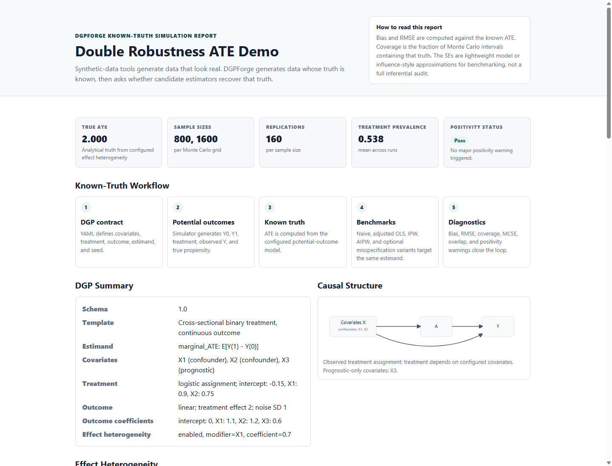

> [!NOTE]
> **Archived STAI-X Challenge 2026 Award C submission.**
> This repository preserves the submitted challenge snapshot and is no longer under active development.
> Active development continues at [PickBranchZ/DGPForge](https://github.com/PickBranchZ/DGPForge).
> The [`award-c-submission` tag](https://github.com/PickBranchZ/DGPForge-STAI-X-Award-C/tree/award-c-submission) identifies the submitted snapshot.

# DGPForge

**Known-truth causal DGP simulation for estimator stress-testing.**

DGPForge is a dual-mode causal simulation agent. It turns an explicit causal DGP contract, or an optional LLM-assisted draft, into potential outcomes, counterfactual truth, Monte Carlo estimator benchmarks, diagnostics, and static reports.

DGPForge lets users specify a causal data-generating process, generates potential outcomes under that process, computes the known causal estimand, and stress-tests estimators and diagnostics against that truth.

Designed for questions like:

- How biased is a naive estimator under observed confounding?
- When does AIPW recover the marginal ATE?
- How do weak overlap, heterogeneous effects, latent confounding, missingness, clustering, and count/rate outcomes affect bias and coverage?
- What assumptions were required to construct the simulation?


## What It Is Not

DGPForge is not a causal discovery engine, not a do-calculus system, not a generic synthetic-data generator, not a general paper-to-code system, not a real-data benchmark, and not an LLM-dependent statistics engine. The parser proposes a causal DGP contract; deterministic Python modules generate and validate the statistical evidence.

## Causal Core

DGPForge's causal unit is an explicit DGP contract. The contract defines covariate roles such as confounder, prognostic variable, effect modifier, latent `U`, and cluster effect; a treatment assignment mechanism; and an outcome model that produces potential outcomes.

The simulator generates causal quantities including `Y(0)`, `Y(1)`, binary-outcome probabilities `p0`/`p1`, count/rate expected counts `mu0`/`mu1`, true propensities, observed treatment, observed outcomes, and optional observed-data missingness. The truth engine reports known marginal causal estimands such as ATE, risk difference, risk ratio, marginal odds ratio, rate difference, and rate ratio.

Estimator stress tests include naive contrasts, adjusted regression, IPW, AIPW, and double-robustness variants under controlled confounding, weak overlap, heterogeneity, latent-U sensitivity, missingness, clustering, and count/rate outcomes. For a compact structural overview, see [docs/CAUSAL_DGP_CONTRACT.md](docs/CAUSAL_DGP_CONTRACT.md).

## Quick Install

Requires Python 3.10 or newer.

```bash
python -m pip install -e ".[dev]"
```

## One-Click Demo Gallery

The static gallery highlights four hero demos first:

- LLM draft -> causal DGP contract -> validated report.
- Observed confounding / AIPW recovery of marginal ATE.
- Public-health count/rate causal estimands with exposure offset.
- Missingness mechanism stress test as a causal-data complication.

All other seeded reports are grouped under **More examples** in the gallery.

Open the local gallery:

```text
examples/generated_reports/index.html
```

Rebuild:

```bash
python scripts/build_demo.py
```

Verify committed static artifacts:

```bash
python scripts/verify_demo.py --check
```

Public repository: `https://github.com/PickBranchZ/DGPForge-STAI-X-Award-C`

Public gallery URL: `https://pickbranchz.github.io/DGPForge-STAI-X-Award-C/`

Local fallback gallery: `examples/generated_reports/index.html`

To host the static gallery in the public mirror, enable GitHub Pages with Source = GitHub Actions. The workflow deploys `examples/generated_reports/`; deployment notes are in [docs/STATIC_GALLERY.md](docs/STATIC_GALLERY.md). For test and benchmark scope, see [EVALUATION.md](EVALUATION.md).



## Dual-Mode Use

DGPForge can run as two connected modules:

- Module A: deterministic causal DGP engine from YAML contracts to validation, potential outcomes, known truth, estimator benchmarks, diagnostics, and reports.
- Module B: optional LLM-assisted contract agent that drafts or reviews causal DGP contracts, then hands only validated contracts to Module A.

The LLM layer is optional. The bundled `mock` provider is deterministic and needs no API key, network call, or external provider dependency. Real provider adapters can be added separately, but statistical evidence is never generated by an LLM.

```bash
dgpforge run --config examples/causal_binary_outcome.yaml --out outputs/binary
dgpforge draft --prompt "Create a simulation with binary treatment, continuous outcome, moderate confounding, 500 units, 100 replications, and compare naive, IPW, and AIPW." --provider mock --out outputs/draft --run
dgpforge from-paper --input examples/paper_excerpt_causal_ate.txt --provider mock --out outputs/paper --run
dgpforge review --config examples/causal_binary_outcome.yaml --provider mock --out outputs/review
```

`draft` and `from-paper` write `draft_dgp.yaml`, assumptions, unresolved questions, and a validation report. `--run` executes the deterministic engine only after schema validation passes. `review` separates deterministic checks from LLM-organized interpretation.

## Why This Is An Agent, Not Just A Script

DGPForge is agentic because it accepts or drafts a causal DGP contract, validates assumptions before execution, computes known causal truth, runs estimators under Monte Carlo, observes overlap, missingness, ICC, overdispersion, unsupported intervals, and calibration error, then responds with reproducible reports and safeguards.

## Manual CLI Commands

```bash
dgpforge run --config examples/causal_ate_randomized.yaml --out examples/generated_reports/randomized
dgpforge run --config examples/causal_ate_observed_confounding.yaml --out examples/generated_reports/observed_confounding
dgpforge run --config examples/causal_ate_weak_overlap.yaml --out examples/generated_reports/weak_overlap
dgpforge run --config examples/causal_ate_heterogeneous_effect.yaml --out examples/generated_reports/heterogeneous_effect
dgpforge run --config examples/causal_ate_double_robustness.yaml --out examples/generated_reports/double_robustness
dgpforge run --config examples/causal_binary_outcome.yaml --out examples/generated_reports/binary_outcome
dgpforge run --config examples/causal_count_rate_outcome.yaml --out examples/generated_reports/count_rate_outcome
dgpforge run --config examples/missing_data_mechanisms.yaml --out examples/generated_reports/missing_data
dgpforge run --config examples/clustered_ate_icc.yaml --out examples/generated_reports/clustered_icc
dgpforge calibrate --config examples/calibration_targets.yaml --out examples/generated_reports/calibration_demo
dgpforge grid --config examples/scenario_grid_causal_ate.yaml --out examples/generated_reports/scenario_grid
dgpforge sensitivity --config examples/unmeasured_confounding_sensitivity.yaml --out examples/generated_reports/unmeasured_confounding_sensitivity
dgpforge from-text --input examples/paper_excerpt_causal_ate.txt --out examples/generated_reports/from_text_demo
dgpforge draft --prompt "Create a public-health count outcome simulation with exposure offset and rate difference estimand." --provider mock --out examples/generated_reports/llm_draft_demo --run
dgpforge from-paper --input examples/paper_excerpt_causal_ate.txt --provider mock --out examples/generated_reports/paper_llm_demo --run
dgpforge review --config examples/causal_binary_outcome.yaml --provider mock --out examples/generated_reports/config_review_demo
```

Optional Streamlit demo:

```bash
python -m pip install -e ".[demo]"
streamlit run streamlit_app.py
```

Mini benchmark:

```bash
python benchmark/run_benchmark.py --write-results
```

Results are written to [benchmark/results.md](benchmark/results.md).

## Feature Hierarchy

The current scope is cross-sectional causal inference with binary treatment and continuous, binary, or count/rate outcomes. Continuous-outcome examples target the marginal ATE. Binary-outcome examples target marginal risk estimands, especially the risk difference, with risk ratio and marginal odds ratio reported as known-truth quantities. Count-outcome examples target marginal public-health-style rates with explicit exposure denominators.

### A. Core Causal Engine

The core engine starts from a causal DGP contract. It defines covariates, roles, treatment assignment, outcome models, estimands, seeds, sample sizes, and estimators; generates potential outcomes; computes known truth; then writes deterministic reports.

- DGP contract with schema validation.
- Treatment assignment mechanism, randomized or covariate-dependent.
- Potential outcomes for continuous outcomes, binary `p0`/`p1`, and count/rate `mu0`/`mu1`.
- Known truth engine for marginal ATE, risk, odds, and rate estimands.

### B. Causal Stress Tests

These modules create controlled causal worlds where estimator behavior can be compared with known truth:

- observed confounding;
- weak overlap and positivity warnings;
- heterogeneous treatment effects;
- latent-`U` / unmeasured-confounding sensitivity grids;
- estimator misspecification and double-robustness variants.

### C. Outcome And Data Complications

These modules keep the same known-truth causal framing while adding realistic observed-data complications:

- binary outcomes and marginal risk estimands;
- count/rate outcomes with exposure offsets;
- missing-data mechanisms;
- clustered ICC;
- calibration targets for synthetic DGP quantities.

## Supported Estimators

- naive difference in means
- adjusted OLS
- adjusted OLS with role-driven confounder omission
- IPW
- IPW with role-driven confounder omission
- AIPW
- AIPW nuisance misspecification variants for the double-robustness demo
- naive risk difference
- logistic g-computation risk difference
- IPW risk difference
- AIPW risk difference
- naive rate difference
- Poisson offset g-computation rate difference
- IPW rate difference
- complete-case continuous, binary, and rate estimators where applicable
- missingness-IPW adjusted OLS for observed outcomes under an observed-data missingness model
- adjusted OLS with naive and cluster-robust standard errors
- optional oracle adjusted model including latent `U` for sensitivity teaching demos

## Supported Diagnostics

- bias
- MCSE for bias
- RMSE
- MCSE for RMSE
- empirical SD
- mean estimated SE
- 95% CI coverage
- MCSE for coverage
- attempted, valid, and failed estimator run counts
- treatment prevalence
- propensity-score overlap
- positivity warning
- binary outcome prevalence, oracle `E[Y(1)]`/`E[Y(0)]`, rare-outcome warnings, and separation warnings
- latent-`U` association diagnostics when unmeasured confounding is enabled
- exposure summaries, observed rates, zero fraction, and overdispersion warnings for count outcomes
- missingness rate, missingness by treatment, complete-case sample size, and MNAR caveats
- cluster count, cluster-size summaries, target/empirical ICC, and few-cluster warnings

## Binary Outcomes And Marginal Risk Estimands

For binary outcomes, DGPForge simulates logistic potential-outcome probabilities `p0` and `p1`, draws binary `Y0` and `Y1`, and reports marginal causal estimands from oracle probabilities:

- risk difference: `E[Y(1)] - E[Y(0)]`
- risk ratio: `E[Y(1)] / E[Y(0)]`
- marginal odds ratio: odds of `E[Y(1)]` divided by odds of `E[Y(0)]`

The logistic treatment coefficient is a conditional data-generating parameter. DGPForge benchmarks estimators against standardized marginal estimands on the probability scale, not against the conditional logistic coefficient.

## Count / Rate Outcomes With Exposure Offsets

For count outcomes, DGPForge simulates an observed exposure denominator such as population or person-time, then generates event counts from `mu_a = exposure * exp(eta_a)`. The known truth is the marginal rate under each intervention:

```text
rate_a = sum_i mu_i(a) / sum_i exposure_i
```

Reports show true rates, rate difference, rate ratio, log rate ratio, exposure summaries, and overdispersion diagnostics. Poisson offset g-computation uses `log(exposure)` as an offset. The naive rate-difference estimator includes a simple independent Poisson rate SE when overdispersion is disabled; other count/rate intervals are left blank unless a valid approximation is implemented.

## Missing Data Mechanisms

Optional `missing_data` contracts apply MCAR, MAR, or MNAR outcome missingness after full potential outcomes are generated. The simulator preserves `Y_full`, writes an observation indicator such as `R_Y`, and keeps the truth engine pointed at the full-data estimand. Complete-case and missingness-IPW examples compare observed-data analyses against that known truth. MNAR mechanisms are supported as DGP stress tests, but observed-data estimators are not presented as solving MNAR bias.

## Clustered Data With ICC

Optional `clusters` contracts create cluster IDs, cluster-level random intercepts, optional cluster-level confounding, and continuous-outcome ICC targets. When ICC is configured, it determines the outcome random-intercept variance relative to the residual variance. The clustered demo compares adjusted OLS with naive standard errors to a manually implemented cluster-robust sandwich SE, emphasizing coverage and uncertainty rather than only point-estimate bias.

## DGP Calibration Engine

The calibration CLI turns design targets into DGP parameters:

```bash
dgpforge calibrate --config examples/calibration_targets.yaml --out examples/generated_reports/calibration_demo
```

It currently calibrates treatment prevalence, binary control outcome prevalence, count baseline rates, and continuous-outcome ICC. Outputs include `calibrated_dgp.yaml`, `calibration_summary.csv`, and `calibration_report.html`. Calibration is approximate and depends on the configured covariate distribution, random seed, and oracle sample size; it is not calibration to official STAI-X data or any external real dataset.

## Unmeasured-Confounding Sensitivity

The sensitivity runner adds a latent normal `U` that can affect treatment and outcome while remaining hidden from observed estimators. It writes a bias heatmap over configured `U -> A` and `U -> Y` strengths.

This is a controlled synthetic stress test. It shows how bias changes under chosen hidden-confounding assumptions; it does not prove hidden confounding is absent in real data.

## Causal Simulation Workflow

1. The YAML causal DGP contract defines covariates, roles, treatment assignment, outcome model, estimand, seeds, sample sizes, and estimators.
2. The simulator generates covariates, true propensity scores, treatment, potential outcomes `Y0`/`Y1`, individual treatment effects, and observed `Y`.
3. The truth engine computes the known marginal causal target from the configured potential-outcome model.
4. The benchmark layer runs estimators and summarizes Monte Carlo behavior.
5. The report layer shows truth, estimator performance, overlap, positivity, assumptions, and reproducibility commands.

## Generated Artifacts

Each report folder contains:

- `report.html`
- `contract.yaml`
- `reproduce.md`
- `estimator_summary.csv`
- `monte_carlo_results.csv`
- `diagnostics.csv`
- `bias_rmse.png`
- `coverage.png`
- `propensity_overlap.png`
- `effect_heterogeneity.png` when heterogeneity is enabled
- `assumptions_log.md` for the from-text demo

LLM-assisted demo folders add `draft_dgp.yaml`, `validation_report.md`, `unresolved_questions.md`, `agent_run_summary.md`, `extraction_trace.md` for paper extraction, and review artifacts such as `review_report.md` and `deterministic_checks.json`.

Scenario-grid folders also include `grid_results.csv`, `scenario_summary.csv`, `grid_bias.png`, and `grid_coverage.png`. Sensitivity folders include `sensitivity_summary.csv`, `sensitivity_grid.csv`, and `sensitivity_bias_heatmap.png`. The demo gallery is `examples/generated_reports/index.html`.

Calibration folders include `calibrated_dgp.yaml`, `calibration_summary.csv`, `calibration_report.html`, and optionally a `run_check/` report generated from the calibrated DGP.

`examples/generated_reports/` contains curated static demo artifacts that are intentionally kept in the repository. Rebuild them with `python scripts/build_demo.py`; that command also refreshes `examples/generated_reports/manifest.json`. Check for stale or modified generated reports with `python scripts/verify_demo.py --check`. The manifest records deterministic path, SHA-256, and size metadata only.

## What Other Participants Can Adopt

- Causal DGP contract pattern.
- Known-truth causal simulation workflow.
- Estimator benchmark table.
- Assumptions log for underspecified extraction.
- Deterministic validator pattern separating proposal from evidence.

## Scope and Safeguards

DGPForge is a causal-structure-aware simulation workbench, not a causal discovery engine, not a real-data synthetic-data generator, and not a do-calculus system. The from-text parser is curated and should not be treated as a general paper reproduction system. SE/CI/coverage are reported only when a valid approximation is implemented; otherwise those fields stay blank instead of showing misleading uncertainty. Missingness, latent confounding, clustering, and calibration are configured DGP mechanisms, not inferred from real data. "Verified" means deterministic contract checks and known-truth Monte Carlo validation under the configured DGP, not universal proof of estimator validity or real-world causal validity.

For module-by-module estimands, truth engines, uncertainty status, and safeguards, see [docs/STATISTICAL_METHODS.md](docs/STATISTICAL_METHODS.md).

For automated test, benchmark, and demo-manifest scope, see [EVALUATION.md](EVALUATION.md).

For the optional contract-agent workflow, see [docs/LLM_ASSISTED_MODE.md](docs/LLM_ASSISTED_MODE.md) and [AGENTS.md](AGENTS.md).

## Extension Points

See [docs/EXTENSIONS.md](docs/EXTENSIONS.md) for concrete expansion notes covering implemented feature packs and future longitudinal regimes, survival outcomes, panel forecasting simulations, and network/interference designs.

## Award C Note

Use [AWARD_C_SUBMISSION.md](AWARD_C_SUBMISSION.md) as the Award C post draft with the public repository and static gallery links.

## License

MIT License. See [LICENSE](LICENSE).
