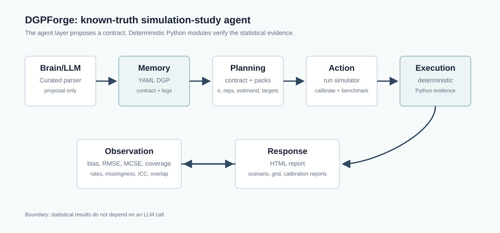

# DGPForge Architecture



## Contract First

The YAML DGP contract is the source of truth. It defines covariates, treatment assignment, outcome model, estimand, sample sizes, replications, seed, and estimators before any data are generated.

Contracts use `schema_version: "1.0"`. Omitted schema versions default to the current version for backward compatibility, but final examples declare the version explicitly. Current template identifiers are registered in `dgpforge/schema.py` for continuous-outcome, binary-outcome, and count/rate cross-sectional causal DGPs.

## Dual-Module Architecture

DGPForge is organized as two connected modules:

- Module A, the deterministic statistical engine: YAML contract input, schema validation, truth engine, simulation, estimator benchmarking, diagnostics, and report generation. It has no LLM requirement.
- Module B, the optional LLM-assisted contract agent: natural-language prompts, paper-style excerpts, or existing YAML are converted into draft/review artifacts. It can hand a validated contract to Module A, but it does not generate statistical evidence.

The assisted workflow is:

```text
Input -> Contract Draft -> Validation -> Execution -> Observation -> Report
```

Execution only starts after the draft contract passes the deterministic `DGPContract` schema. If validation fails, DGPForge writes validation errors and stops before simulation.

## Parser And Agent Layers

`dgpforge/curated_parser.py` powers `dgpforge from-text` and is deliberately deterministic and curated. It parses one simple cross-sectional ATE paper-style excerpt, writes a contract, and records underspecified details in `assumptions_log.md`. `dgpforge from-paper` is the provider-assisted structured extraction workflow. Neither mode is a general paper reproduction system, and neither produces statistical evidence.

`dgpforge/llm/` is the optional assisted layer. It includes a provider protocol, deterministic `MockProvider`, structured response schemas, and workflows for:

- `dgpforge draft`: prompt to `draft_dgp.yaml`, assumptions, unresolved questions, validation report, optional deterministic run.
- `dgpforge from-paper`: text excerpt to `draft_dgp.yaml`, extraction trace, assumptions, validation report, optional deterministic run.
- `dgpforge review`: existing YAML to deterministic checks plus LLM-organized review text.

`from-text` remains a curated parser demo. `from-paper` is LLM-assisted extraction from a text excerpt and still does not claim general paper reproduction.

## Deterministic Simulation Layer

`simulate.py` generates covariates, optional latent `U`, optional clusters, true propensity scores, treatment, potential outcomes `Y0` and `Y1`, individual effects or risk differences, and observed outcomes. Binary-outcome DGPs expose oracle probabilities `p0` and `p1`. Count/rate DGPs expose exposure denominators, rates, and expected counts `mu0`/`mu1`. Missingness is applied after full data generation so `Y_full` and observation indicators remain available. No external datasets are used.

## Truth Engine

`truth.py` computes the known marginal target. Continuous linear examples use analytical ATE truth. Binary logistic examples use deterministic oracle Monte Carlo over counterfactual probabilities to report `E[Y(1)]`, `E[Y(0)]`, risk difference, risk ratio, and marginal odds ratio. Count/rate examples report marginal rates as `sum(mu_a) / sum(exposure)`, plus rate differences and ratios.

## Estimator Benchmark Layer

`estimators.py` benchmarks continuous-outcome estimators, binary risk-difference estimators, count/rate estimators, complete-case and missingness-IPW variants, cluster-robust OLS, and role-driven nuisance misspecification variants used by the double-robustness demo. Each estimator returns an estimate, standard error, and 95% interval when an approximation is implemented for that row. Unsupported SE/CI fields stay `NA`, so coverage is unavailable rather than misleading.

## Diagnostics and Observation Layer

`diagnostics.py` and `monte_carlo.py` summarize bias, RMSE, Monte Carlo standard errors, attempted/valid estimator denominators, empirical SD, mean estimated SE, coverage, treatment prevalence, propensity-score overlap, binary outcome prevalence, exposure/rate diagnostics, missingness diagnostics, cluster/ICC diagnostics, latent-`U` associations, and warnings.

## Scenario Grid Layer

`grid.py` expands a base contract into ordinary DGP contracts across sample size, confounding strength, and treatment-effect heterogeneity. It reuses the same Monte Carlo and report layers, then writes combined grid CSVs, plots, and a compact `report.html`.

## Sensitivity Layer

`sensitivity.py` expands a binary-outcome base contract over latent-confounder effects on treatment and outcome. It reuses the same Monte Carlo/report layers for each cell, then writes `sensitivity_summary.csv`, `sensitivity_grid.csv`, and a bias heatmap report.

## Calibration Layer

`calibration.py` loads a base DGP and calibrates selected DGP parameters to requested synthetic design targets. It currently supports treatment prevalence, binary baseline outcome prevalence, count baseline rate, and continuous-outcome ICC. The output is a calibrated contract plus a target-vs-achieved report; it is not fitted to official STAI-X data or any external real dataset.

## Report Layer

`report.py` writes a screenshot-ready HTML report with inline CSS, summary cards, a known-truth workflow, DGP summary, causal structure sketch, estimator table, plots, assumptions log, and reproducibility command.

`scripts/build_demo.py` regenerates the static demo gallery at `examples/generated_reports/index.html`, all example reports, mock LLM-assisted demo artifacts, and the mini benchmark Markdown artifact.

## Why The LLM Is Not Trusted For Evidence

The agent/parser layer may help draft a DGP contract, but DGPForge treats that contract as something to validate and run deterministically. The statistical claims in the report come from the simulator, truth engine, estimators, and diagnostics, not from an LLM response.

## Extension Points

Future templates can add longitudinal causal inference, survival outcomes, richer multilevel estimators, panel forecasting, network/interference designs, richer nuisance models, and stronger paper-to-contract extraction with human review gates.
